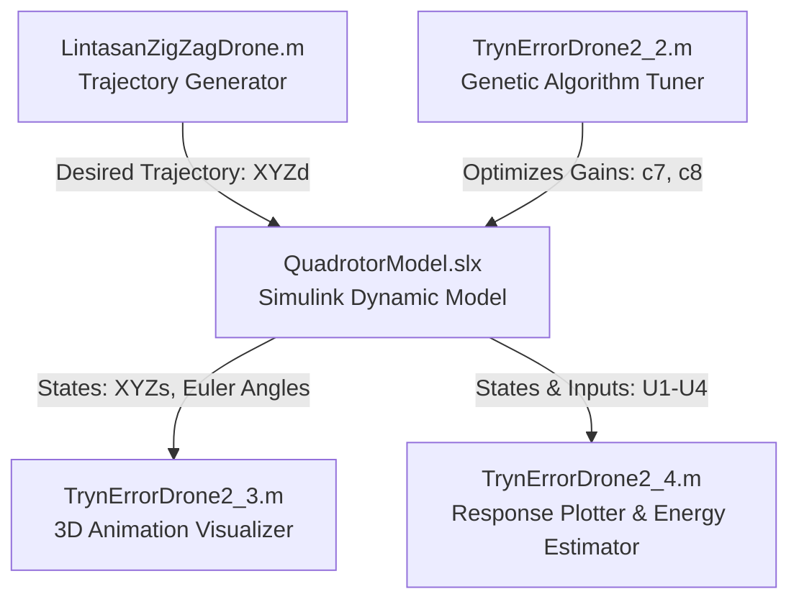

# Map Scanning Quadrotor (Zig-Zag Trajectory & Backstepping Control)

An academic engineering project focused on the design, simulation, control optimization, and 3D visualization of a Quadrotor UAV performing a map scanning mission. The quadrotor traverses a pre-planned zig-zag scanning path over a defined coordinate space, controlled via an optimized **Backstepping Controller**.

---

## 📌 Project Overview

This project provides a complete MATLAB & Simulink workflow to:
1. **Generate a Zig-Zag Scanning Trajectory** for a quadrotor drone.
2. **Design a Non-linear Backstepping Controller** to command the attitude and altitude of the quadrotor.
3. **Optimize Controller Gains** ($c_1 \dots c_8$) using a **Genetic Algorithm (GA)** to minimize overshoot, settling time, and steady-state error.
4. **Animate Flight Performance in 3D** showing the actual path vs. the desired path.
5. **Evaluate Energy Consumption** and analyze time-domain responses of states and control inputs.

---

## 🏗️ System Architecture

---

## 📂 File Directory & Structure

| File / Folder | Description |
| :--- | :--- |
| **`LintasanZigZagDrone.m`** | Generates a 2D zig-zag search grid for a specified scanning area and plots a 2D path animation. |
| **`QuadrotorModel.slx`** | Simulink model representing the quadrotor's 6-DOF rigid body dynamics and its cascade Backstepping controllers. |
| **`TrynErrorDrone2_2.m`** | Optimizes Backstepping control gains ($c_7$ and $c_8$) using MATLAB's Genetic Algorithm (`ga`) toolbox based on step-response metrics. |
| **`TrynErrorDrone2_3.m`** | Visualizes the flight trajectory in a interactive 3D MATLAB animation plot, rendering the drone's body frame orientation. |
| **`TrynErrorDrone2_4.m`** | Plots time-domain state responses ($x,y,z,\phi,\theta,\psi$), control inputs ($U_1 \dots U_4$), and integrates power to calculate energy usage. |
| **`DataLintasanDroneFix(ScanningMode).mat`** | Saved simulation dataset containing pre-computed flight trajectory records for immediate analysis. |
| **`Report.pdf`** | Academic project report outlining the equations of motion, control system design, and experimental results. |

---

## ⚙️ Mathematical Model & Control Strategy

### 1. Backstepping Control
The controller is designed using a recursive lyapunov-based backstepping methodology. It resolves control inputs $U_1, U_2, U_3, U_4$ to stabilize:
- **Altitude ($z$) & Attitude ($\phi, \theta, \psi$)**
- Controller gains $c_1 \dots c_8$ determine the speed and stability of convergence.

### 2. Genetic Algorithm Optimization
In `TrynErrorDrone2_2.m`, the controller parameters are tuned by minimizing the following multi-objective fitness function:

$$J = t_s + 10 \cdot OS + 100 \cdot e_{ss}$$

Where:
* $t_s$: Settling Time (within a 2% threshold)
* $OS$: Percent Overshoot
* $e_{ss}$: Steady-State Error

---

## 🚀 How to Run the Simulation

1. **Prerequisites**: Ensure MATLAB (R2020a or newer), Simulink, and the *Global Optimization Toolbox* (for GA) are installed.
2. **Generate Path**: Run `LintasanZigZagDrone.m` to generate the scanning trajectory coordinate vectors.
3. **Run GA Optimization**: Open and run `TrynErrorDrone2_2.m` to search for optimal control gains.
4. **Simulate Model**: Open `QuadrotorModel.slx` in Simulink and click **Run**.
5. **Analyze Results**: 
   - Run `TrynErrorDrone2_3.m` to view the 3D path-following animation.
   - Run `TrynErrorDrone2_4.m` to inspect individual response plots and energy consumption statistics.

---

## 📈 Sample Results & Performance Metrics

* **Trajectory Profile**: Zig-zag scanning coverage of $50\text{m} \times 55\text{m}$ area with $10\text{m}$ lane intervals.
* **Energy Consumption**: Calculated in real-time by integrating kinetic power across all translational and rotational velocity states.
